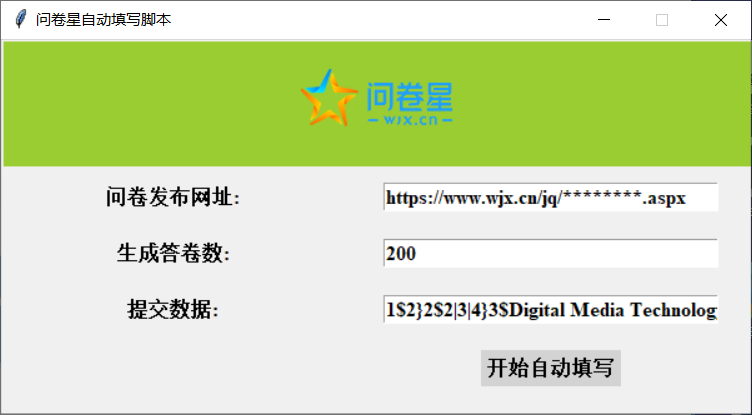

# 问卷星:star:自动填写脚本

[](https://travis-ci.org/Jocoboy/WengJuanXing-Auto-Fill)  

## :mag:Preview



## :book:Usage

- 问卷发布网址
    ```
    格式：https://www.wjx.cn/jq/********.aspx
    ```

- 生成答卷数

- 提交数据
    ```
    格式：
    '1$2': 代表第一题选择第二个选项
    '3$2|3|4': 代表第三题选择第2、3、4个选项
    '2$I am a student': 代表第二题填写“I am a student”
    ```
    更多用法：
    你可以修改```wjx.py```中的```set_data```方法来自定义递交数据的规则

    例如：
    ```
        def set_data(self):
        self.data = {
            'submitdata': '1$'+str(random.randint(1, 3))
        }
    ```

## Dependencies

```
pip install requests
```

## Contribution & Feedback

如果你有更好的建议...

:octocat: @Jocoboy 

:e-mail: Jocoboy@outlook.com