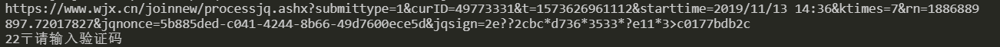
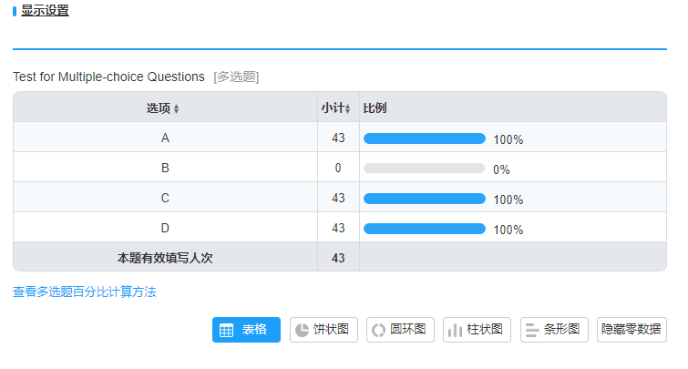

# Test for One-choice Questions

## settings

```
ACCESS_URL = 'https://www.wjx.cn/jq/49773331.aspx'
SAMPLE_NO = 50
SUBMIT_DATA = '1$2'
```

## result


Two failed among all by the following mistakes.



## Test for Multiple-choice Questions

## settings

```
ACCESS_URL = 'https://www.wjx.cn/jq/49773331.aspx'
SAMPLE_NO = 50
SUBMIT_DATA = '1$1|3|4'
```

# result



Seven failed among all by the following mistakes.


